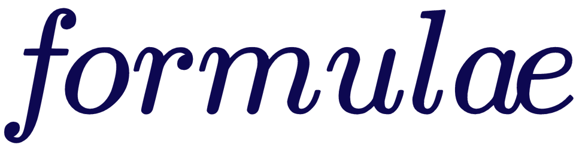

<center>
</img>
</center>

<center>

[](https://badge.fury.io/py/formulae)
[](https://codecov.io/gh/bambinos/formulae)
[](https://github.com/psf/black)

</center>

Formulae is a Python library that implements Wilkinson's formulas for mixed-effects
models. It was written to make group-specific effects convenient in
[Bambi](https://github.com/bambinos/bambi), but it can also be used independently
as a backend for another library. Formulae extends classical statistical formulas in
a way inspired by R's [lme4](https://CRAN.R-project.org/package=lme4).

## Dependencies

Formulae requires Python 3.8 or later, plus the versions of NumPy, SciPy, and Pandas
specified in [pyproject.toml](https://github.com/bambinos/formulae/blob/master/pyproject.toml).

## Installation

Install the latest release with pip:

```bash
pip install formulae
```

Or install the development version directly from GitHub:

```bash
pip install git+https://github.com/bambinos/formulae.git
```

## History, related projects, and credits

Formulae was built to provide Bambi with a concise syntax for mixed-effects models.
Before Formulae, Bambi used [Patsy](https://patsy.readthedocs.io/) to parse formulas
and build design matrices. Patsy is flexible and robust, but does not support mixed
model effects. Formulae therefore adopted the familiar `|` syntax from lme4 and
builds the common and group-specific design matrices Bambi needs.

Its main function, `design_matrices()`, returns a wrapper around the response,
common-effects, and group-effects matrices, along with methods and metadata useful
to downstream libraries.

Formulae draws on the following projects and references:

- [Wilkinson and Rogers (1973)](https://doi.org/10.2307/2346786), where the formula
  notation originated.
- [R](https://www.r-project.org/), a widely used implementation of Wilkinson's
  formulas.
- [lme4](https://CRAN.R-project.org/package=lme4), for the `|` operator and mixed
  effects matrix construction.
- [Patsy](https://patsy.readthedocs.io/), especially its evaluation-environment
  implementation.
- [Formulaic](https://matthewwardrop.github.io/formulaic/), whose backtick and quote
  operators inspired Formulae's equivalents.

If you only need design matrices for linear models with fixed effects, Patsy or
Formulaic may be a more direct fit. Formulae is designed primarily for developers
and libraries that need to construct design matrices automatically for mixed-effects
models.

## Contributors

See the [GitHub contributors page](https://github.com/bambinos/formulae/graphs/contributors).

## Contributing

We welcome contributions from interested individuals and groups. See the
[contributing guide](https://github.com/bambinos/formulae/blob/master/CONTRIBUTING.md)
for the project's workflow and pull request checklist.

## License

[MIT License](https://github.com/bambinos/formulae/blob/master/LICENSE)
